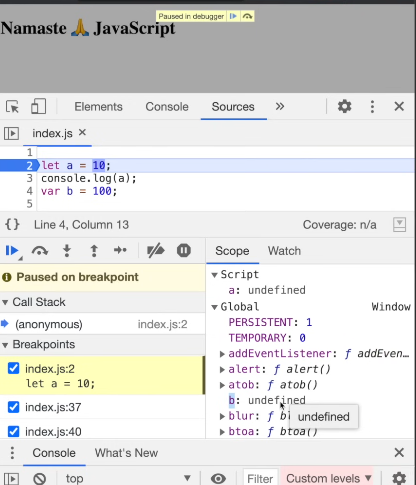

- So this event loop gives chance to micro task queue, before the callback queue
- there can be a case, where micro task me jo task hai, creates a task in microtask, which then creates a micro task and so on
- iss ke vajah se, the task in callback queue never gets chance to execute, this leads to starvation 

- Ignition interpreter with the optimizing compiler, these both things make js run very fast 
 
- js code goes thru parser, where the parser creates a AST, abstract syntax tree 
- AST passed to Interpreter Ignition, which converts to byte Code 
- Along with interpreter, works the compiler TurboFan,
- compiler TurboFan constantly works on optimizing the code, and it produces the optimized machine code which is then converted to byte code

### JS ep 1
- Everything in js happens inside execution context 
- Execution context is a whole container, where whole js code is executed
- It has 2 components 
    - Memory
        - includes variables and key functions
        - Its sort of called as a variable environment, where all variables and functions are stored as key value pairs
    - Code 
        - This is where the code is executed one line at a time
        - It is also called as thread of execution
- Js is synchronous single threaded language 
    - what it means by synchronous, is that it can execute the js code in specific order, and it can move to next line only after it has executed the current line 

### JS ep 2
- Execution context is created in 2 phases 
    1. Memory Creation phase
        - Line by line it will store 
        - Initially when storing variables, it will store special value as 'undefined' 
        - In case of functions, unka fn logic is stored as value
    2. code execution phase
        - Again it executes line by line
        - whenever we see a function with parenthesis '()' it means fn is gonna get executed 
        - Whenever a function is invoked, a new execution context is created 
            - This new execution context is gonna hae memory creation and code phases
            - function execute karte samay, when encountered 'return' keyword, it tells ki return the control to the place where it was invoked
            - once function is executed, the execution context will be completely deleted
    - once all the logic of program is completed, global execution context is destroyed 
- How does js manages the execution context ka creation, deletion? 
    - it manages in call stack, meaning it has its own call stack
    - at bottom of stack there is global execution context
    - when new execution context is created, is put at top of stack 
    - when it's deleted, it is popped out of stack
    - call stack manages order of execution of 'execution context'
    - call stack is known by many names, 
        - execution context stack 
        - call stack
        - program stack 
        - control stack
        - runtime stack 
        - machine stack 

### JS ep 3
- when we run a index.js file with no contents, then also global execution context is created, and then destroyed
- window object has lots of functions
    - they are created and provided by js engine
    - window is a global object that is created along with global execution context
    - along with window object, a 'this' variable is created 
    - Chrome has v8 engine as js engine, firefox has its own
    - so every engine has responsibility to create these objects, like the window obj, this keyword
    - So whenever, we create any variable or function in global space(global space is where the variables or function aren't created inside function), it gets attached to window object, and we can access the variables and functions from the global object
    - let's say **var a = 10** kiya
        - so when we are actually doing console.log(a) or this.a, we are actually calling window.a 

### JS undefined vs not defined
- 'undefined' is like a placeholder for values,
- jaise when we declare a variable a = 5
- after global execution context created, memory me space is allocated to a with 'undefined' value, 
- jab memory wala part will be executed then 5 allocated hoga, so yeah its like a placeholder(undefined wala value) 
- there is difference between undefined and 'not defined'
- not defined is like not being allocated to something
- js is loosely typed lang
- loosely typed language are also known as weakly typed language    
- its a bad practice to assign 'undefined' as value to a variable 

### JS scope chain
- function a(){
    console.log(b)
}
var b = 10;
a();
- when a is called, fn a will look for variable named b within the fn itself, when it doesn't find value, then it will search for the value outside the fn.
- scope is where you can access specific variable, 
- what is scope of variable b? meaning where can i access the variable b   
- scope directly related to lexical environment
- Whenever a execution context is created, a lexical environment is also created 
- lexical matlab sequence, hierarchy, so 
- every execution context will have access to lexical env of its parent, matlab ki access to the memory section of its parent
- lexical environment of global execution context is null,
- so, when execution context trying to find value, and usko current execution context me nai mila vo variable ka value, it will go to lexical environment of its parent, and it will go on till it gets the value, 
    - agar value null value aata hai at the end, it will show the variable is not defined
    - This way of finding, the value of variable is called as scope chaining 

### 
- let and const declarations are also hoisted, but they are in temporal dead zone, look at 'let a'
- 
- so let and const ke variables are stored in another seperate memory, not global memory, and we cannot access them unless we put value on them
- Temporal Dead Zone
    - TDZ is the phase since when the variable is hoisted, that is space has been allocated and undefined assign kiya hai uss variable ko('let' wala variable) till the time usko initialize kiya ho
    - Basically its the phase from hoisting until it gets assigned a value
    - WHen we try to access the variable in temporal dead zone, it gives reference error 

- How the f* can we do this?
var a = 10
var a = 1000
but we cant do this using let or const

when using const, we need to declare as well as initialize in the same line

- Errors
    - Reference error 
        - when you can't access a variable, but you are trying to access it
    - Syntax Error
        - missing syntax or problem with syntax
    - Typed error
        - assigning different type to const

- always use const whenever u can
- if not const, use let wherever possible
- always keep declarations of variables at top