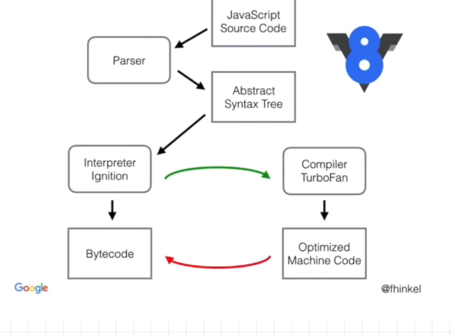

- So this event loop gives chance to micro task queue, before the callback queue
- there can be a case, where micro task me jo task hai, creates a task in microtask, which then creates a micro task and so on
- iss ke vajah se, the task in callback queue never gets chance to execute, this leads to starvation 

- Ignition interpreter with the optimizing compiler, these both things make js run very fast 
 
- js code goes thru parser, where the parser creates a AST, abstract syntax tree 
- AST passed to Interpreter Ignition, which converts to byte Code 
- Along with interpreter, works the compiler TurboFan,
- compiler TurboFan constantly works on optimizing the code, and it produces the optimized machine code which is then converted to byte code

### JS ep 1
- Everything in js happens inside execution context 
- Execution context is a whole container, where whole js code is executed
- It has 2 components 
    - Memory
        - includes variables and key functions
        - Its sort of called as a variable environment, where all variables and functions are stored as key value pairs
    - Code 
        - This is where the code is executed one line at a time
        - It is also called as thread of execution
- Js is synchronous single threaded language 
    - what it means by synchronous, is that it can execute the js code in specific order, and it can move to next line only after it has executed the current line 

### JS ep 2
- Execution context is created in 2 phases 
    1. Memory Creation phase
        - Line by line it will store 
        - Initially when storing variables, it will store special value as 'undefined' 
        - In case of functions, unka fn logic is stored as value
    2. code execution phase
        - Again it executes line by line
        - whenever we see a function with parenthesis '()' it means fn is gonna get executed 
        - Whenever a function is invoked, a new execution context is created 
            - This new execution context is gonna hae memory creation and code phases
            - function execute karte samay, when encountered 'return' keyword, it tells ki return the control to the place where it was invoked
            - once function is executed, the execution context will be completely deleted
    - once all the logic of program is completed, global execution context is destroyed 
- How does js manages the execution context ka creation, deletion? 
    - it manages in call stack, meaning it has its own call stack
    - at bottom of stack there is global execution context
    - when new execution context is created, is put at top of stack 
    - when it's deleted, it is popped out of stack
    - call stack manages order of execution of 'execution context'
    - call stack is known by many names, 
        - execution context stack 
        - call stack
        - program stack 
        - control stack
        - runtime stack 
        - machine stack 
