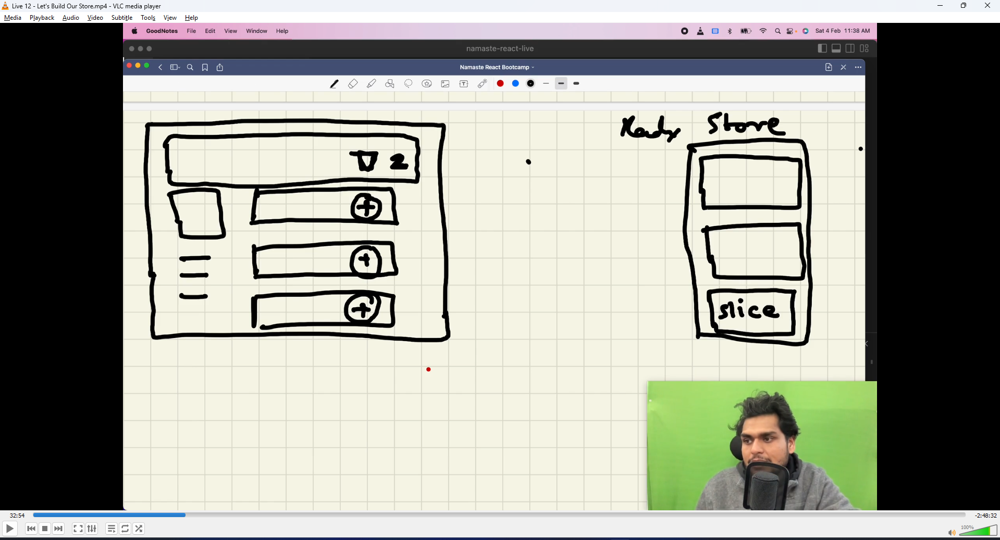
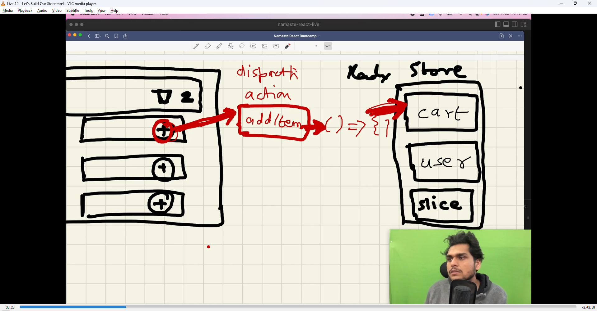
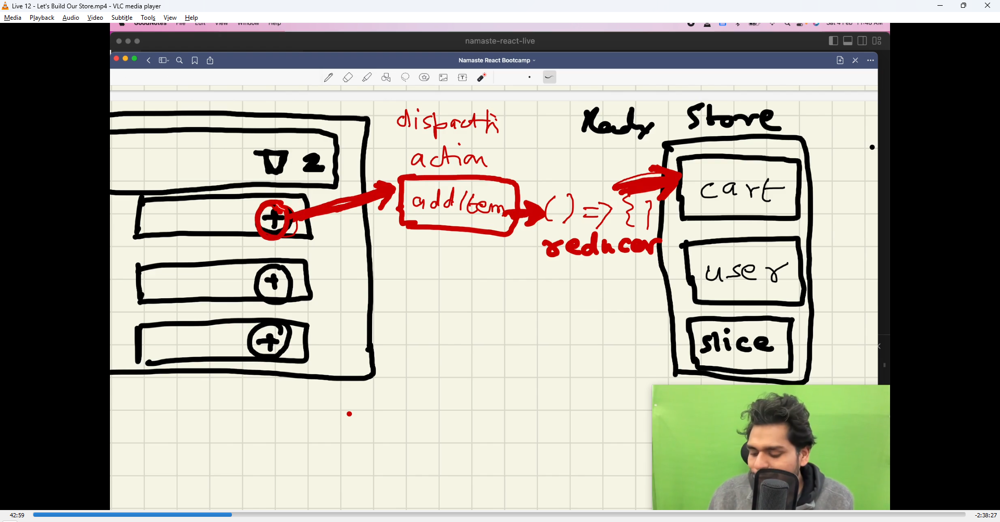
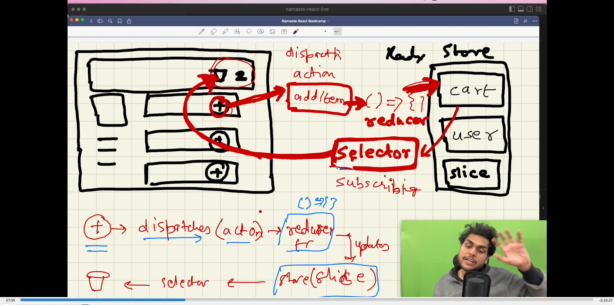
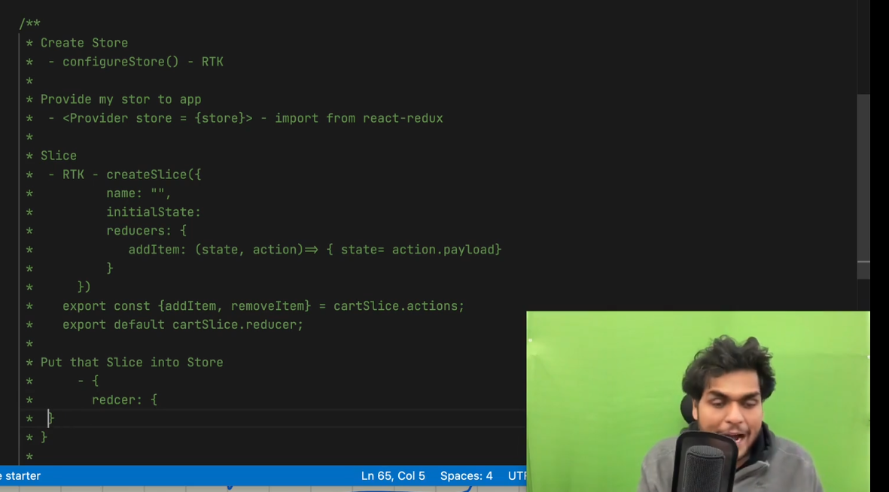
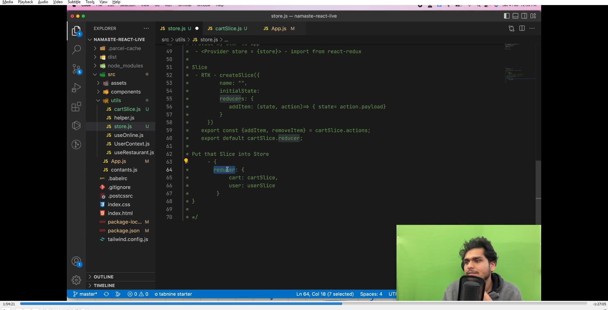

### Why redux ?

- we need redux to manage the data layer of the application
- we used useContext to avoid prop drilling
- So any component in the app can access context, also they can modify the context
  - but when the app grows a lot, thats where redux comes into picture
- Redux is used for data management

- context is useful while building small applications
- but when building large applications which needs lot of data handling, thats where redux can help - in managing the data, modifying the data

- Disadvantages of redux
  - complex to setup
  - complex learning curve

- To solve the disadvantages like complex things, redux came up with redux toolkit

- Difference between redux and redux toolkit
  - it solves things like too much boilerplate code in redux

### REDUX architecture

- redux store is like a big object
- our web app is different and store is different
- Ways of handling data
  - state and props
  - context
  - redux store

- unlike context, where we could create multiple context, in redux store we have single store for storing everything
  
  - inside redux store, there are slices of store
    - slice is a portion of our store
- components in app cannot modify the store
  - instead we have to dispatch an action
    - e.g "add item" as action - this action will call a fn which would be js fn, and that function is going to modify the store
      
    - when we click on button, it calls dispacther, dispatcher calls a fn, which is a reducer, which updates the slice of the store
    - When we click on "+" button(on UT), we dispatch an action lets say "add item", which then calls a reducer fn, which updates the slice of the store
      
      - why do this? why not directly update the store? bc to record every change in state we do

- selector means selecting the slice or portion of the store
- click on "+" button -> dispatches an action by dispatcher -> calls the reducer function -> updates the store -> using selector selecting portion of store and read data -> which will update the card(UI me)
- selector is a hook,
  - when they say "the card component has subscribed to the store",
    - means reading from or in sync with store
    - meaning whenever the store will be modified, the card component will be modified
      

- When we click on + button, we dispatch an action, which calls a reducer function, which updates the slice of the store,
  - this is the write cycle
- In read cycle
  - the card component(in UI) is subscribed to my store using selector(which is a hook, known by useSelector)

- while using redux, we need redux toolkit as well as react-redux, why?
  - bc redux contains the core functionality of redux, and react-redux bridges react with redux

---

- While using redux, after configure redux, the store is different and our app is different, we need some sort of way to connect both of them, we need a provider
- const cartSlice = createSlice({
  name : "abc",
  initialState: {
  items: []
  },
  reducers: {
  addItem: ()=>{
  }
  }
  })
- here in reducers section, addItem is the name of the action, it is mapping to the reducer function, which is executed, when dispatcher calls the action "addItem"
- Steps taken to create reducer toolkit
  
  
