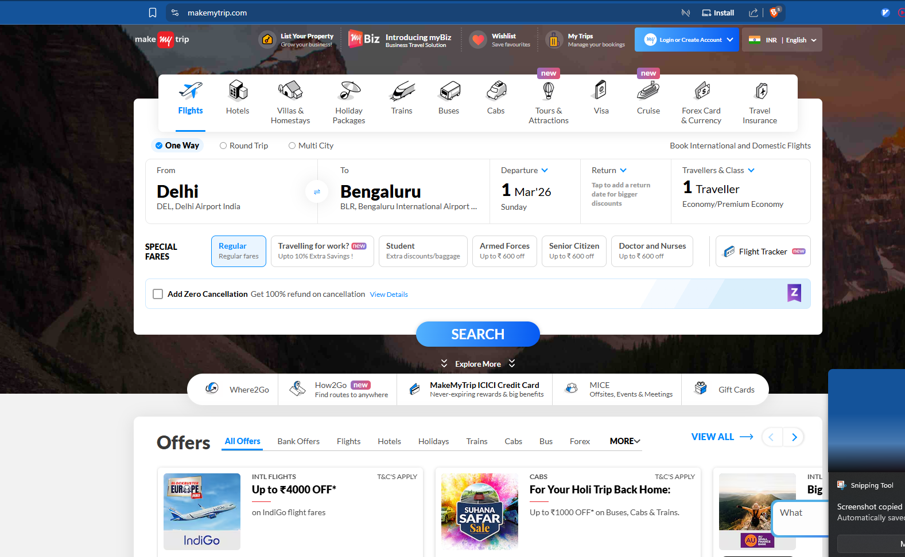

- Each component that we create should have single responsibility
- if doing multiple things in component, we should break it down in multiple components
- modularity is we breaking down components into smaller moduls

CUstom hooks

- while creating custom hook, finalize the input and output of the hook

- While creating custom hooks, its not mandatory to use the word "use" while naming the custom hooks, its just recommended approach

- WHen we say parcel, as a bundler, what it does, is it bundles all the files into one single file, its core functionality

- In bundler, its helpful as it bundles into single file, but in some cases lets say makemytrip, where there would be thousand of files, in that case if we make use of bundler it would bundle 1000s of component into single one, which might make it slower in performance
  - so for this, we make use bundling, but for each file, which is called as chunking or dynamic loading/bundling, code splitting
  - in makemytrip,
    
  - we can make use of code splitting, by creating a bundler for each section, like "flights", "hotels", "buses", this will help in reducing load for each bundler, instead of making a single bundler which would bundle all the components

- lazy is a fn given to use by react
  1:20: wala video dekh ep9
  - when we use lazy, usse kya hoga ki, lets say home page me grocery section i applied lazy, then jab page is loaded, obv the grocery section is not loaded, so if user clicks on grocery section, it will show error, as at that moment the section is not loaded
    - ussi ke liye we make use of suspense
